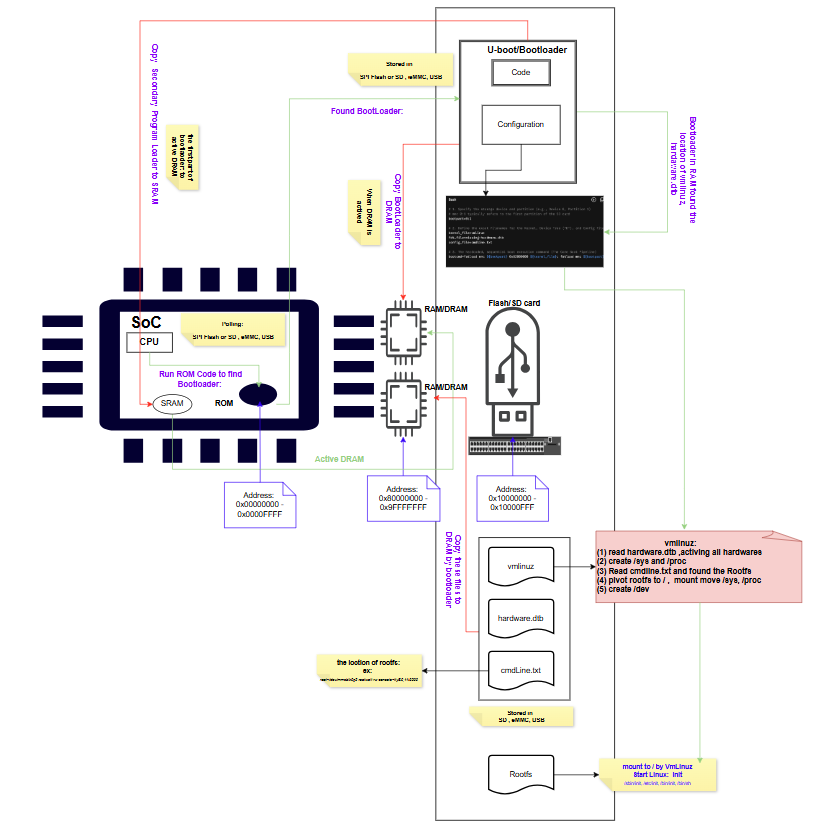

# Bootloader and Kernel Handover

Recently, I got interested in custom Linux image creation and wanted to look into a few popular build tools like **debootstrap**, **Buildroot**, and **Yocto**. In the past, I spent a long time working in embedded systems, and I used to flash bootloaders all the time. But to be honest, back then, I never really dug deep into the exact mechanics under the hood. I just treated the bootloader as this black box—knowing full well that without it, none of the code on our boards would ever run.

However, I realized that if I didn't get a solid grasp of the actual bootloader flow before messing with image creation tools, any files I generated later (like the kernel, boot.bin, Device Tree, or the final sdcard.img image) would just be things I copied and pasted without really understanding why.

So, I sat down, used AI to bounce ideas off of, and broke down the exact sequence of how an embedded Linux chip wakes up and hands over control to user space. To keep it straight in my head, I put together this diagram , focusing on separating the **Control Flow** (who is running what) from the **Data Flow** (what file is being moved where).

### Phase 1: Power-On & The SRAM Rescue (Control Flow Starts)

- **The Reality**: The moment the board powers on, the main external DRAM (system memory) cannot be used yet because its timing hasn't been set up. The CPU is running blind.
- **Control Flow**: The CPU automatically jumps to a hard-coded internal **ROM** region (address range 0x00000000 - 0x0000FFFF) and executes the native **ROM Code**.
- **Data Flow**: The ROM Code polls storage devices like SPI Flash, eMMC, or an SD card. Since only the tiny internal **SRAM** is working at this stage, it copies the bootloader's first small component (like the SPL, or Secondary Program Loader) into SRAM to run it. Its main job is to initialize the external DRAM.

### Phase 2: DRAM Activation & Loading the Pieces (Control & Data Converge)

- **Control Flow**: Once the external DRAM (address range 0x80000000 - 0x9FFFFFFF) is up and running, control moves to the full **U-Boot / Bootloader** code.
- **Data Flow**: U-Boot reads its configuration and scripts, then pulls the core pieces of the OS from the storage medium (address range 0x10000000 - 0x10000FFF) into the DRAM memory.
- **The Four Components Loaded into RAM**:

### Phase 3: Handing Over Control to the Kernel

- **Control Flow**: U-Boot finishes its job and jumps directly to the **vmlinuz kernel** in DRAM, passing along the memory address of the Device Tree.
- **The Kernel's Next Steps**: The kernel wakes up and does a few key things:

### A Few Simple Takeaways

Breaking down linux_bootloader.jpg helped me realize something that felt a bit counter-intuitive at first:

> **The Bootloader doesn't read the Device Tree to figure out how to boot. Instead, the Bootloader just grabs the kernel, the Device Tree, and the boot arguments, dumps them all into memory like a package, and hands it to the kernel. The kernel is the one that reads the package to figure out where it is.**

Figuring this out saved me a ton of headache:

- **First**, I finally understand how the Bootloader, Kernel, and Device Tree actually hand off the baton to each other.
- **Second**, I have massive respect for the developers who write low-level firmware. Managing to make this whole sequence run perfectly under tight bare-metal constraints is amazing.
- **Third**, it confirmed that trying to understand the system structure is always better than forcing myself to memorize a checklist. Now that I know how these files interact, I can jump into Buildroot or debootstrap and actually understand what they are trying to automate. I won't be staring at generated images wondering what they are for anymore.

*#LinuxKernel #Bootloader #EmbeddedSystems #SystemsEngineering #SoftwareDevelopment #CPlusPlus*
