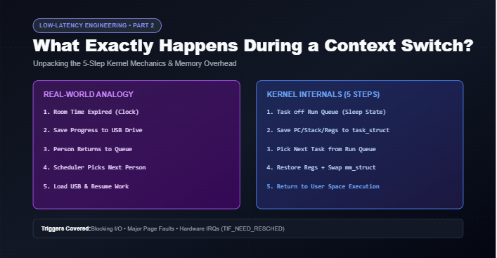
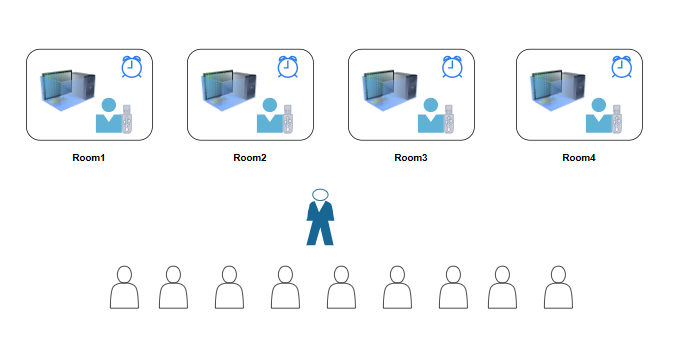
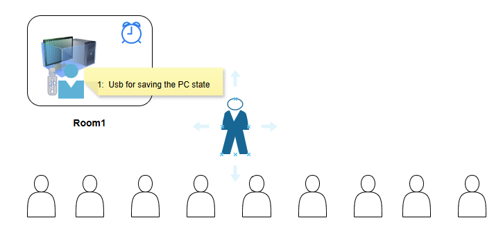
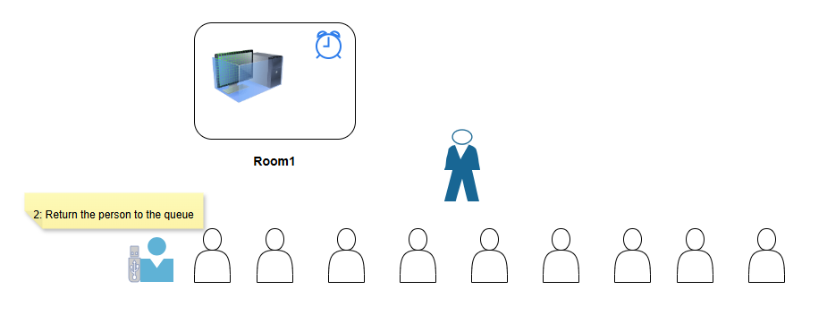
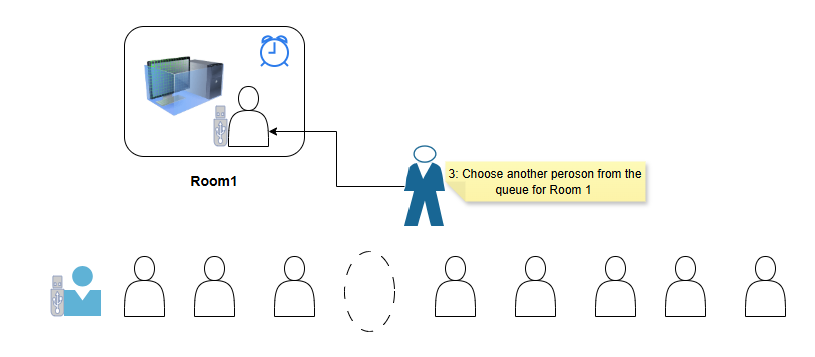
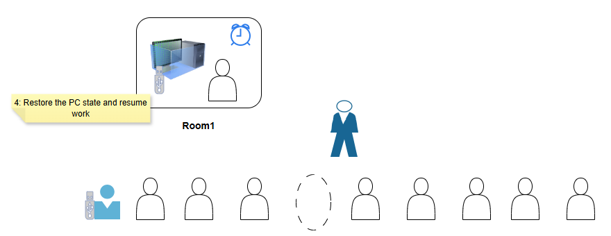
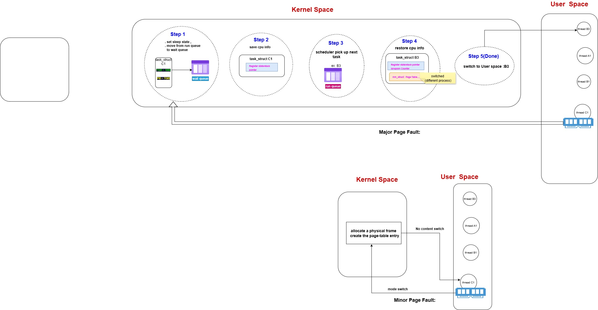
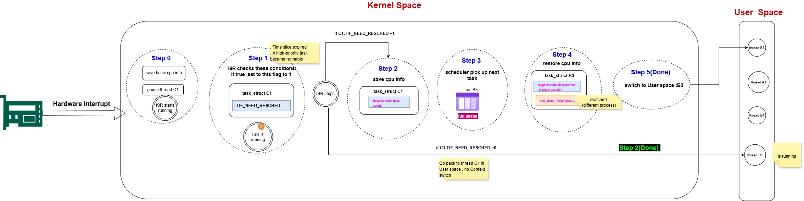

# Low-Latency Engineering 2: What Exactly Happens During a Context Switch?

In the first post of this series, I covered the general picture: a **mode switch** happens whenever the CPU drops into kernel space (hardware interrupt, system call, fault, or trap), and it *may or may not* escalate into a full **context switch** — a different task taking over the CPU.

That was the 30,000-foot view. This post is the zoom-in: **what does the kernel actually do, step by step, when a context switch happens** — and why does it cost what it costs?

---

## First, a Real-World Analogy

Before diving into kernel internals, I built this analogy to keep the mental model straight in my head:

Here's how to read it:

- Each **Room** (Room1, Room2, Room3, Room4) represents a **CPU core**.
- The **computer inside each room** represents the CPU's execution resources.
- The **clock on each room** represents the **time slice** — the fixed amount of time a task is allowed to run before it has to give up the room.
- Each **person** represents a **task** (a thread or process, in kernel terms).
- The **person in the dark suit** is the **scheduler** — the one who decides who gets to enter which room next.
- The **line of people waiting** represents tasks sitting in a queue, waiting for their turn to use a CPU.
- The **USB drive** represents the part of `task_struct` that holds everything needed to pause and later resume a task: register state, stack pointer, program counter — the CPU state I described in Part 1.

Now watch what happens when **Room1 times out** (the clock runs out — the time slice expires):

1. **Save the PC state to the USB drive** — the person currently in Room1 gets their "progress" saved onto the USB so nothing is lost.
   
   

2. **Return the person to the queue** — they're pulled out of the room and sent back to the back of the line, since they didn't finish.
   
   

3. **Choose another person from the queue for Room1** — the scheduler picks whoever's next in line.
   
   

4. **Restore the PC state and resume work** — the new person sits down, and the room's computer is set up exactly the way *that* person left off last time (or freshly, if it's their first turn).
   
   

That's it. That's a context switch, in plain terms: **save the state of whoever's leaving, pick who's next, restore that new person's state, let them run.**

---

## The Same Four Steps, Now in Kernel Terms

Every context switch I looked at — no matter what triggered it — follows this same shape. In kernel terms, it's usually laid out as five steps:

- **Step 1**: The current task is marked as no longer runnable (e.g., set to sleep state) and moved off the CPU's run queue.
- **Step 2**: The kernel **saves CPU info** for the outgoing task — register state, stack pointer, program counter — into its `task_struct`. (This is the "USB drive" step.)
- **Step 3**: The **scheduler picks the next task** to run from the run queue.
- **Step 4**: The kernel **restores CPU info** for the incoming task from its `task_struct`.
- **Step 5**: Execution actually resumes — control switches back to user space, running the new task.

The one detail worth calling out in Step 4: if the incoming task belongs to a **different process** than the outgoing one, the kernel also has to switch `mm_struct` — the memory mapping / page tables. That's the expensive part I mentioned in Part 1: a different process means a different address space, which usually means TLB entries built up for the old task are no longer valid for the new one. If the incoming task is just another *thread of the same process*, `mm_struct` doesn't need to change at all, which is exactly why staying within threads (instead of separate processes) is cheaper.

Now let's look at the three different events that can trigger this sequence — because the *path into* these five steps looks different each time.

---

## Trigger 1: A Blocking System Call

This is the `read()` example from Part 1: thread **C1** calls `read()`, but the I/O isn't ready yet. Since C1 can't make progress, it has no choice but to give up the CPU:

- **Step 1**: C1 is set to sleep state and moved from the run queue to the **wait queue** (it's not just "not running" — it's specifically waiting on an event, like data becoming available).
- **Step 2**: CPU info for C1 is saved into `task_struct C1`.
- **Step 3**: The scheduler pulls the next runnable task off the run queue — in this example, **B3**.
- **Step 4**: CPU info is restored from `task_struct B3`. Notice the diagram flags this as **"switched (different process)"** — meaning B3's `mm_struct` and page tables are different from C1's, so that mapping has to be swapped in too.
- **Step 5**: Control returns to user space, and thread **B3** starts running.

C1 stays parked in the wait queue until whatever it was waiting for (the I/O) becomes ready — at which point it's moved back to the run queue to wait its turn again.

---

## Trigger 2: Page Faults — Why "Minor" and "Major" Are Completely Different Animals

This is the distinction from Part 1 that I said deserved its own explanation — and once you see the two side by side, it's obvious why they behave so differently.

**Minor page fault (bottom half of the diagram):** the data the task needs is already sitting in physical memory — it just doesn't have a page-table entry pointing to it yet (this happens constantly with things like lazy allocation or copy-on-write). So the kernel simply:

- Allocates a physical frame reference and creates the page-table entry.
- Returns control to the *same* thread.

That's it — **no content switch**. It's a mode switch that resolves almost immediately, and the diagram labels it exactly that way: mode switch in, fix the mapping, mode switch back out, same thread continues.

**Major page fault (top half of the diagram):** the data isn't in memory at all — it has to be fetched from disk (or swap). This is exactly the same situation as the blocking `read()` above: the task genuinely cannot proceed until slow I/O finishes, so it goes through the **full five-step sequence** — sleep state, save CPU info, scheduler picks another task, restore CPU info for that task (potentially switching `mm_struct` if it's a different process), resume in user space.

Same trigger category (a fault), completely different cost — because the deciding factor isn't "what kind of fault," it's **"does the task have to wait on something slow."**

---

## Trigger 3: Hardware Interrupts — The One With a Built-In Decision Point

Hardware interrupts are the most interesting case, because they make the "always mode switch, sometimes context switch" rule from Part 1 completely explicit as an actual branch in the code:

- **Step 0**: The interrupt arrives. The CPU saves *basic* CPU info, pauses the current thread (C1), and the **ISR (Interrupt Service Routine)** starts running. This part always happens — it's the mode switch, guaranteed, no matter what the interrupt turns out to be about.
- **Step 1**: While the ISR is running, it checks a specific condition: **has C1's time slice expired, or has a higher-priority task just become runnable?** If either is true, it sets a flag — `TIF_NEED_RESCHED` — to 1 on `task_struct C1`. Then the ISR finishes and stops.

Now the kernel checks that flag:

- **If `TIF_NEED_RESCHED == 0`**: nothing else needs to happen. Control goes straight back to thread C1 in user space, exactly where it left off. **No context switch** — the mode switch resolved on its own.
- **If `TIF_NEED_RESCHED == 1`**: now the full sequence kicks in — save full CPU info for C1 (Step 2), scheduler picks the next task, e.g. B3 (Step 3), restore CPU info for B3, switching `mm_struct` if needed (Step 4), and control resumes in user space as B3 (Step 5).

This is the clearest illustration of the general principle: **the interrupt itself only guarantees a mode switch.** Whether it escalates into a context switch is decided by a flag check that happens *after* the interrupt has already been handled — completely independent of what the interrupt was actually about.

---

## Why This Level of Detail Actually Matters

Once you've seen the five steps broken down like this, the cost of a context switch stops being an abstract "it's expensive" and becomes a concrete list of things that are actually happening:

- A task gets pulled off (or pushed onto) a queue — scheduler bookkeeping.
- Registers, stack pointer, and program counter get saved and restored — real memory writes/reads, not free.
- If the incoming task is from a different process, `mm_struct` and page tables get swapped — which is exactly the kind of event that flushes out the TLB entries and cold-starts the cache I talked about in the false-sharing and NUMA posts.

And it explains why the advice from Part 1 holds up: minor page faults and simple syscalls skip almost all of this entirely (mode switch only); blocking syscalls, major page faults, and interrupts that flip `TIF_NEED_RESCHED` pay the full price.

*This is post 2 of the series. Next up: what actually causes a page fault in the first place, and how prefaulting your memory ahead of time (`mlockall` + `memset`) avoids paying for major page faults at all during the critical path.*

Ever wondered what actually happens, step by step, when the kernel takes the CPU away from one task and hands it to another? Part 2 of my low-latency series breaks down the context switch mechanism — from a real-world room analogy to the exact kernel steps behind system calls, page faults, and hardware interrupts.
