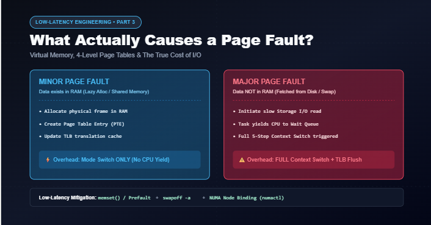
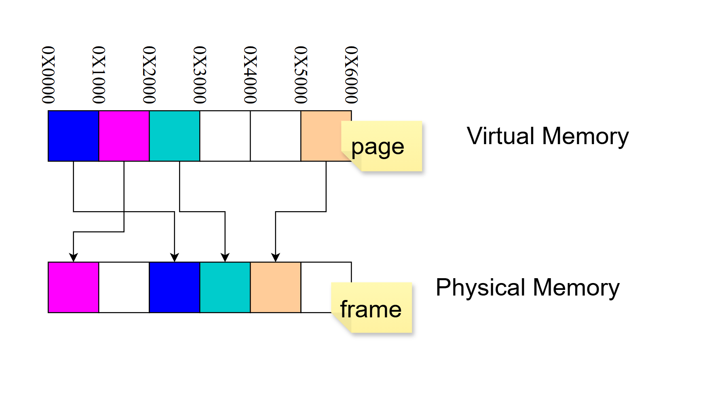
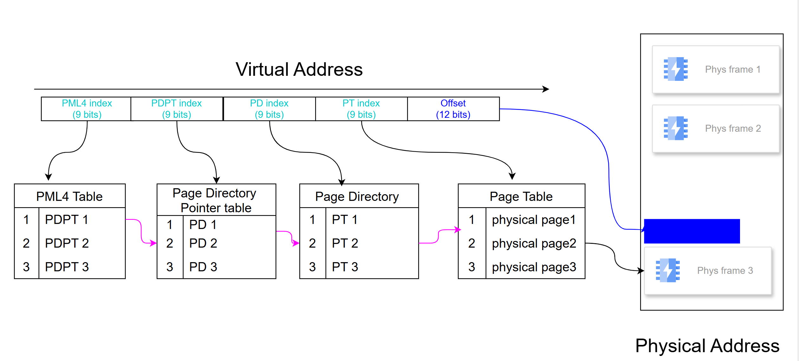
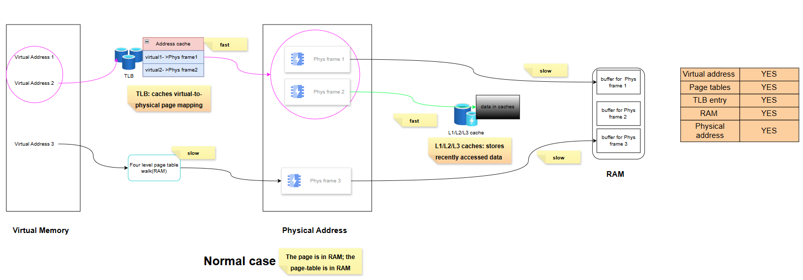
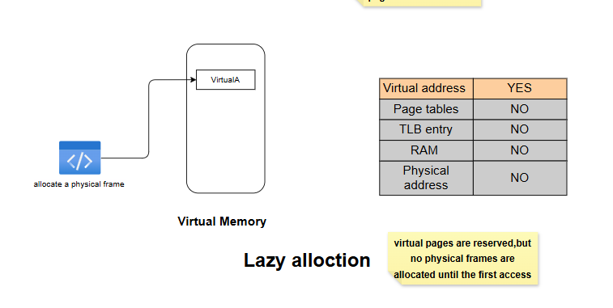
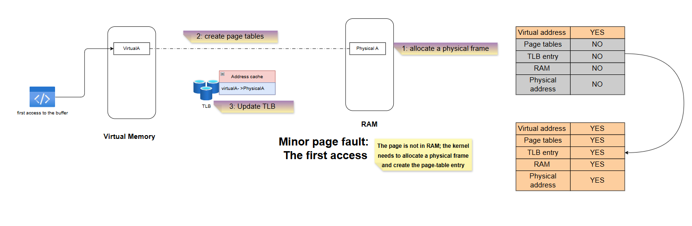
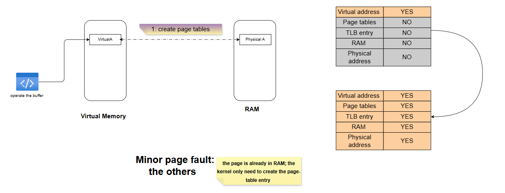
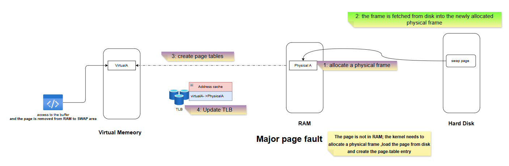
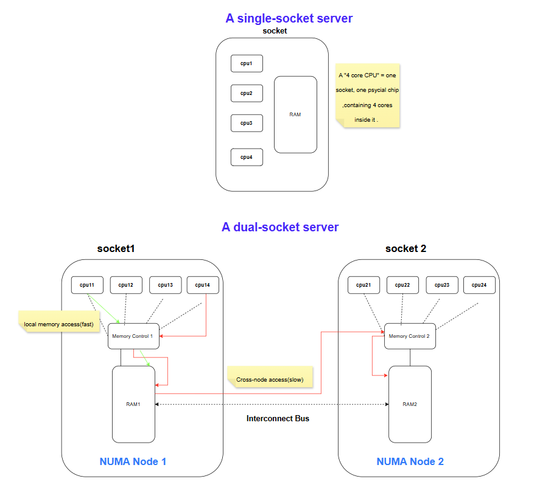

# Low-Latency Engineering: What Actually Causes a Page Fault?

Back in Part 1, I mentioned that not all page faults are created equal — a minor page fault is just a mode switch, but a major page fault escalates into a full context switch (the expensive kind, with disk I/O involved). I promised a dedicated post on this, because the distinction matters enormously for real-time systems, and you can't really understand it without first understanding how the kernel finds data in memory in the first place.

So this post starts from the very basics — virtual addresses, physical addresses, pages, and frames — and builds up to exactly what happens, step by step, during a minor fault versus a major fault.

---

## 1. Virtual Address, Physical Address, Page, and Frame

These four terms get used almost interchangeably in casual conversation, but they mean four different things:

- **Virtual address**: the address your program actually uses. It's not real — it's an abstraction the kernel maintains for every process.
- **Physical address**: the real location in RAM where data actually lives.
- **Page**: virtual memory is chopped up into fixed-size chunks called pages (commonly 4KB).
- **Frame**: physical memory is chopped up into fixed-size chunks called frames — same size as a page, so any page can fit into any frame.

The diagram above makes the key point visually: **a page's position in virtual memory has nothing to do with where its frame ends up in physical memory.** The magenta page at `0x1000` in virtual memory maps to a frame that's physically first in RAM; the blue page at `0x0000` maps to a frame sitting in the middle. The mapping is arbitrary — which is exactly why the kernel needs a lookup structure to keep track of it: the **page table**.

---

## 2. From Virtual Address to Physical Address: The Four-Level Page Table Walk

On x86-64, a virtual address is split into five pieces: four 9-bit indices and one 12-bit offset. The 12-bit offset is exactly why pages are 4KB (2^12 = 4096) — that's the piece that doesn't need translation at all, since it's just "how far into this page" the byte you want is located.

The four 9-bit indices are used to walk down through four levels of tables, one lookup at a time:

**PML4 index → PML4 Table → PDPT index → Page Directory Pointer Table → PD index → Page Directory → PT index → Page Table → physical frame number.**

Combine that physical frame number with the 12-bit offset, and you have the exact physical address. That's four sequential memory reads (one per table level) just to translate a single address — and that's the *slow path*, which brings us to the normal case.

---

## 3. The Normal Case: No Page Fault at All

Walking four levels of page tables for every single memory access would be brutally slow, so the CPU caches recent translations in the **TLB (Translation Lookaside Buffer)**. If the translation for a virtual address is already sitting in the TLB, the CPU skips the four-level walk entirely and jumps straight to the physical frame — that's the fast path. If it's not there (a **TLB miss**), the CPU has to fall back to the full four-level walk described above — slower, but this is still **not a page fault**, because every table and every entry the walk needs actually exists in RAM. The kernel never has to get involved.

Once the physical frame is located, there's a second layer of speed-up that's completely separate from address translation: **L1/L2/L3 cache**, which stores recently accessed *data* (not address mappings). If the data you want happens to be sitting in cache, that's fast; if not, it's a normal RAM access — still not a fault, just a regular memory read.

The point of walking through this "boring" case first: **a page fault only happens when the page table itself doesn't have a valid entry for the address you're accessing.** Everything above — TLB hits, TLB misses, cache hits, cache misses — is just varying degrees of "fast" or "slow," but none of it involves the kernel stepping in. A page fault is a fundamentally different situation: the translation genuinely doesn't exist yet, and someone has to go build it.

---

## 4. Minor Page Fault: Two Different Flavors

A minor page fault means: the data itself is available somewhere in RAM, the kernel just needs to fix up the bookkeeping (page table entry, TLB) so the translation exists. But there are actually two different situations that lead here, and they're worth separating.

### 4.1 The First Access (Lazy Allocation)

When you `malloc()` or `mmap()` memory, the kernel doesn't actually hand you physical memory right away — it just reserves a range of virtual addresses. Nothing else exists yet: no page table entry, no TLB entry, no physical frame. This is **lazy allocation**, and it's exactly why "allocating" a huge chunk of memory is nearly instantaneous — the kernel is just promising you the address space, not the actual RAM.

The moment your code actually touches that memory for the first time, this happens:

1. **Allocate a physical frame** — the kernel finds a free frame in RAM.
2. **Create the page table entry** — now there's an actual mapping from virtual address to physical frame.
3. **Update the TLB** — so the next access to this address is fast.

This is precisely the mechanism behind **prefaulting**, which I mentioned back in the low-latency optimization checklist: if you deliberately `memset()` your entire buffer right after allocating it, you force all of this — frame allocation, page table creation, TLB update — to happen during initialization, instead of silently happening (and costing you a mode switch) the first time your hot path touches that memory under load.

### 4.2 "The Others": The Frame Already Exists Somewhere

Sometimes the physical frame already exists in RAM — for example, a shared library page, or a page inherited from a parent process via copy-on-write — but *this specific task* doesn't have its own page table entry pointing to it yet. In that case, the kernel doesn't need to allocate a new frame or touch the disk at all. It just needs to **create the page table entry**, pointing this task at the frame that's already there. This is the cheapest possible fault: one bookkeeping step, done.

Both of these minor fault scenarios only ever escalate to a **mode switch** — never a context switch — because nothing here requires the task to wait. The kernel does a small amount of work and hands control right back.

---

## 5. Major Page Fault: When the Kernel Has to Go to Disk

A major page fault happens when the page genuinely isn't in RAM at all — it has to be fetched from disk (either it was previously swapped out, or it's a file-backed page that was never loaded). The steps:

1. **Allocate a physical frame.**
2. **Fetch the page from disk** into that newly allocated frame.
3. **Create the page table entry.**
4. **Update the TLB.**

Step 2 is the entire problem. Disk I/O is orders of magnitude slower than anything else on this list, so the task genuinely cannot proceed — it has to give up the CPU and wait. That's exactly why a major page fault escalates all the way into a **full context switch**, following the same five-step sequence I broke down in Part 2 (sleep state, save CPU info, scheduler picks another task, restore CPU info, resume in user space).

This is also exactly why the standard low-latency fix is: **prefault your memory (Section 4.1) and disable swap entirely (`swapoff -a`)**. If there's no swap space to page out to, and everything's already been touched once during initialization, a major page fault on your hot path becomes structurally impossible instead of just unlikely.

---

## 6. One More Wrinkle: Where Is "RAM" Actually Sitting?

Everything above quietly assumed "RAM" is one uniform pool. On a single-socket server, that's basically true — one memory controller, one pool, done.

But on a multi-socket (NUMA) server, RAM is physically split into node-local chunks, each attached to a different socket's memory controller. When a page fault allocates a new physical frame (Section 4.1 or Section 5), that frame gets allocated on *some* NUMA node — and if it ends up on a different node than the CPU core your thread is actually running on, every single access to that memory afterward pays a **cross-node latency penalty**, on top of whatever the fault itself cost.

This is one of the reasons multi-socket servers, despite offering more total cores, are often *not* the obvious win they look like for latency-sensitive workloads — more sockets means more opportunities for a fault to hand you memory that's physically far from the core doing the work. It's also why some latency-critical systems deliberately choose single-socket hardware: one less category of "silent, ongoing tax" to reason about.

---

## Bringing It Together

Once you can see the full picture — TLB, four-level page tables, minor faults with their two flavors, major faults, and now NUMA sitting underneath all of it — the earlier advice stops being folklore:

- "Prefault your memory" — forces every minor fault to happen once, upfront, instead of silently during the hot path.
- "Disable swap" — removes the possibility of a major fault ever happening at all.
- "Watch out for NUMA" — because even a resolved fault can leave you with a frame sitting on the wrong node.

*This is post 3 of the series. Next up: pulling everything together into a practical playbook — how to actually reduce context switches (and even mode switches) on your hot path, plus the other techniques (CPU isolation, IRQ affinity, huge pages, false-sharing-safe data structures, and more) that round out a real low-latency setup.*

Page faults aren't all created equal — a minor one is nearly free, but a major one drags your task through a full context switch and a trip to disk. Part 3 of my low-latency series breaks down virtual memory, page tables, and exactly what the kernel does differently between the two.
