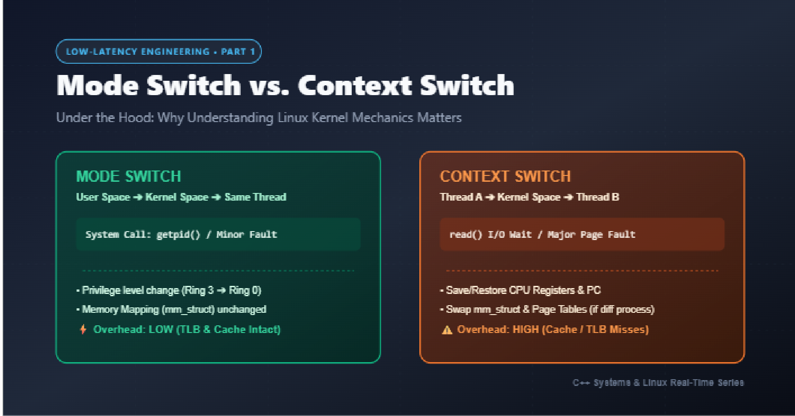
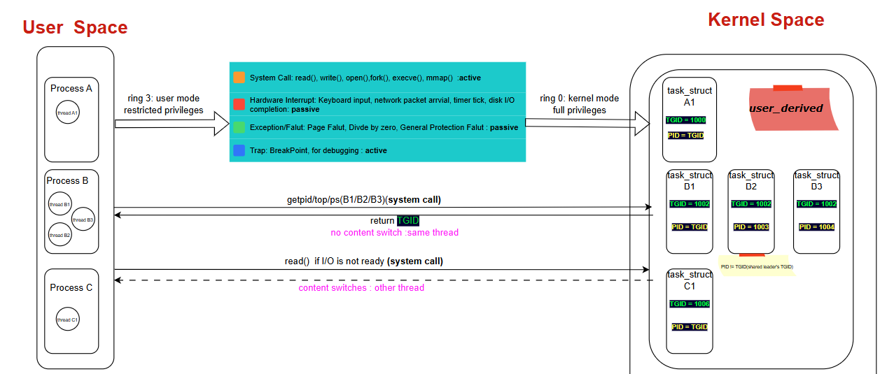
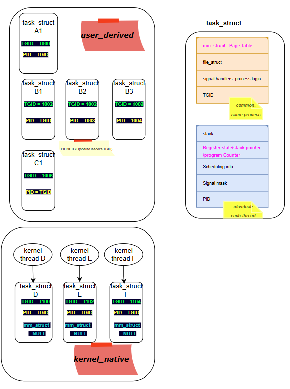
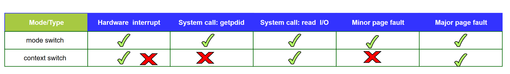

# Low-Latency Engineering 1: Why I Stopped Memorizing Rules and Started Reading the Kernel

If you've ever researched low-latency systems, you've seen the same checklist everywhere: *reduce context switches, minimize system calls, isolate hardware interrupts, avoid false sharing.* I collected all of these rules a while back. I could recite them. I could apply them.

But I couldn't answer a simple question: **why do these specific things cost so much?**

That bothered me the same way it bothered me in a previous deep-dive of mine — knowing *how* to apply a rule without knowing *why* it exists is fragile knowledge. You forget an edge case. You miss a "small" detail that turns out to be the actual bottleneck. And in low-latency engineering, it's almost always the small details — a stray interrupt, an unpinned kworker, two unrelated variables sharing a cache line — that quietly destroy the tail latency you spent weeks optimizing for.

So I went back to basics and started reading how Linux actually works underneath these rules. This is the first post in a series — starting with the most foundational question of all: **what is a context switch, really, and why does it cost what it costs?**

Here's the diagram I put together to keep this straight in my head — user space processes/threads on the left, kernel space `task_struct`s (including kernel-native threads) on the right, and the anatomy of `task_struct` itself on the far right:

---

## 1. User Space and Kernel Space

Everything we normally write and run — our applications, our shell, our GUI — lives in **user space**. But none of it can actually touch hardware directly. Underneath, there's **kernel space**, which is the part of the OS that has full control over the CPU, memory, and devices. Kernel space is what keeps the whole machine alive; user space is just a restricted guest that has to ask kernel space for permission whenever it needs something real (memory, a file, network access, a new process).

## 2. Process, Thread, and the Kernel's Own View: `task_struct`

In user space, we learned early on that **processes don't share resources**, while **threads within the same process do** (same memory space, same file descriptors, etc.).

The kernel, however, doesn't really think in terms of "process" or "thread" as separate categories. Whether it's a user-space thread, a user-space process, or a kernel-native thread, the kernel represents *all of them* with the same structure: a **`task_struct`**. Everything the scheduler manages is a "task."

Every `task_struct` carries two IDs that matter a lot here:

- **TGID** (Thread Group ID) — this is the process ID as we know it.
- **PID** (in kernel terms, this is actually the individual thread's ID)

This explains something I always took for granted: if you call `getpid()` from two different threads of the *same* process, you get the *same* number back. That's because `getpid()` returns the **TGID**, not the per-thread PID. The kernel uses these two IDs together to know instantly whether two tasks belong to the same process (same TGID) or are completely unrelated processes.

Beyond the IDs, `task_struct` holds two things that turn out to be central to everything about context switching:

- **`mm_struct`** — the memory descriptor (page tables, virtual memory layout). All threads of the same process point to the **same** `mm_struct`. This is exactly why "prefer threads over processes when you can" is good advice for latency: switching between two threads of the same process means the kernel doesn't have to reload/restore the memory mapping — it's already the same.
- **Register state / stack pointer / program counter** — this is the actual execution state of the task. No matter what kind of switch is happening, this has to be saved and restored, or the task literally cannot resume where it left off.

Notice on the right-hand side of the diagram above: kernel-native threads (D, E, F) have their `mm_struct` set to **NULL** — they don't own a user-space memory mapping at all, because they never need one.

## 3. Mode Switch vs. Context Switch: The Full Picture

This is the section that finally made everything click for me, so I'll build it up piece by piece: first the two definitions, then the general rule that ties them together, then a walk through every trigger type.

### 3.1 Mode Switch: Crossing the User/Kernel Boundary

When execution moves from user space into kernel space — say, because your code called a system call — that transition itself is called a **mode switch**. The CPU literally changes privilege rings (ring 3 → ring 0). It doesn't necessarily mean a different task starts running; it just means *the same task* is temporarily executing in a more privileged mode.

### 3.2 Context Switch: When a Different Task Takes Over

A **context switch** is a different, more expensive event: Thread A was running in user space, dips into kernel space, but when execution comes back out, it's not Thread A anymore — it's **Thread B**. That's a context switch: a different task resumes on the CPU, which means the kernel has to save Thread A's full execution state and load Thread B's.

### 3.3 The General Rule: What Always Happens, and What Might Happen

Here's the rule that ties everything together: **hardware interrupts, system calls, faults, and traps (like debugging breakpoints) always cause at least a mode switch.** That part is guaranteed — the CPU has to drop into kernel space no matter which of these four triggers it.

Whether that mode switch *escalates* into a full context switch is a separate question, and it depends entirely on what happens once the kernel is in control. Sometimes the kernel does its job and hands control right back to the exact same task. Other times, the task has to give up the CPU — and that's when a different task gets scheduled in, which is the actual context switch.

With that rule in mind, here's how it plays out for each trigger type:

- **Hardware interrupts** — always a mode switch. Whether it escalates into a full context switch depends on whether the interrupt handler wakes up a higher-priority task that needs to run immediately.

- **System calls** — always a mode switch, but whether it escalates depends on what the call actually does:
  
  - A simple call like `getpid()` — just a mode switch. The kernel does its (very fast) job and returns to the *same* thread.
  - A call like `read()` on a file — if the I/O isn't ready yet, the calling thread has to block and give up the CPU, so this escalates into a **context switch**: some other thread now runs while this one waits.

- **Faults** — always a mode switch, and this is the one distinction I almost glossed over, but it turns out to matter enormously:
  
  - A **minor page fault** (data is already in memory, kernel just needs to fix up the page table) stays a **mode switch only**.
  - A **major page fault** (kernel has to go to disk/swap to bring data in) escalates into a full **context switch** — the calling thread gets swapped out while the slow I/O happens.
  
  Page faults are a deep topic on their own, and I'll be dedicating the next post in this series entirely to how page faults occur and how to eliminate them in real-time systems.

- **Traps** (like a debugger breakpoint) — same pattern: always a mode switch, and whether a context switch follows depends on what happens next.

The pattern that jumps out: **hardware interrupts and major page faults always cost a full context switch. `getpid()`-style syscalls and minor page faults never do.** `read()` sits in between — it depends entirely on whether the data was already available.

---

## Why This Matters for Low-Latency Systems

Once you see it this way, the usual low-latency advice stops being a checklist and starts being obvious:

- "Avoid unnecessary system calls" — because even a cheap one is a mode switch, and an I/O-blocking one is a full context switch with all the state save/restore overhead that implies.
- "Isolate hardware interrupts from your critical core" — because interrupts are *always at least* a mode switch, and often trigger a full context switch if they wake up a competing task.
- "Prefer threads over processes for latency-sensitive work" — because threads in the same process share `mm_struct`, so a context switch between them skips the memory-mapping restore entirely.

*This is post 1 of a series where I'm digging into the "why" behind low-latency Linux engineering, one mechanism at a time.*

- `#LinuxKernel`

- `#ContextSwitch`

- `#CpuArchitecture`

- `#LowLatency`
