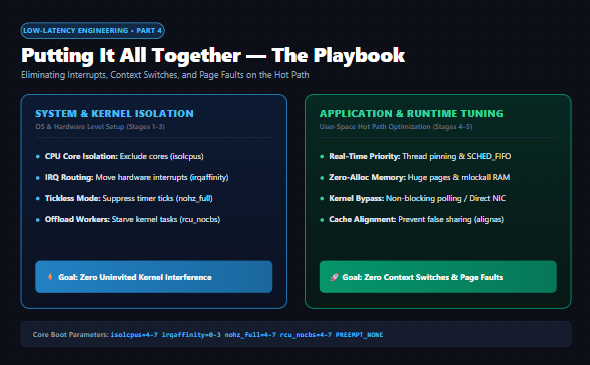
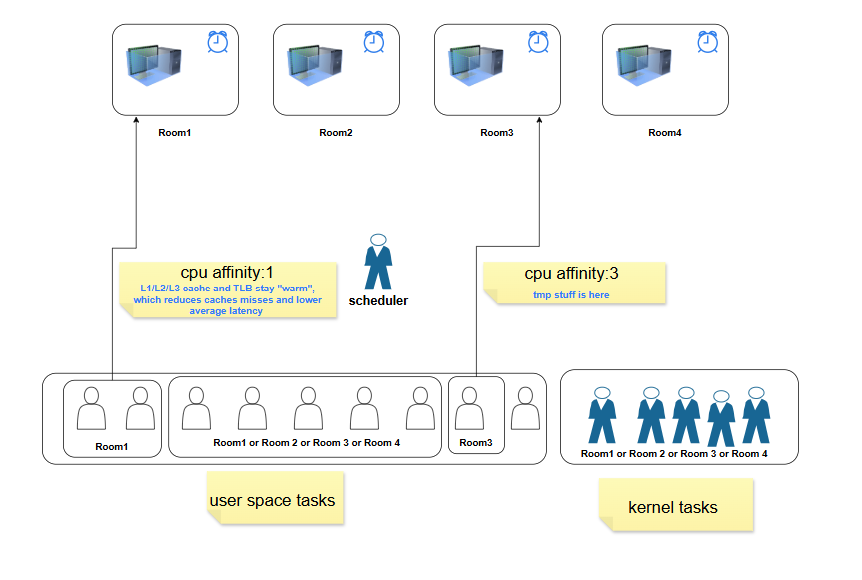
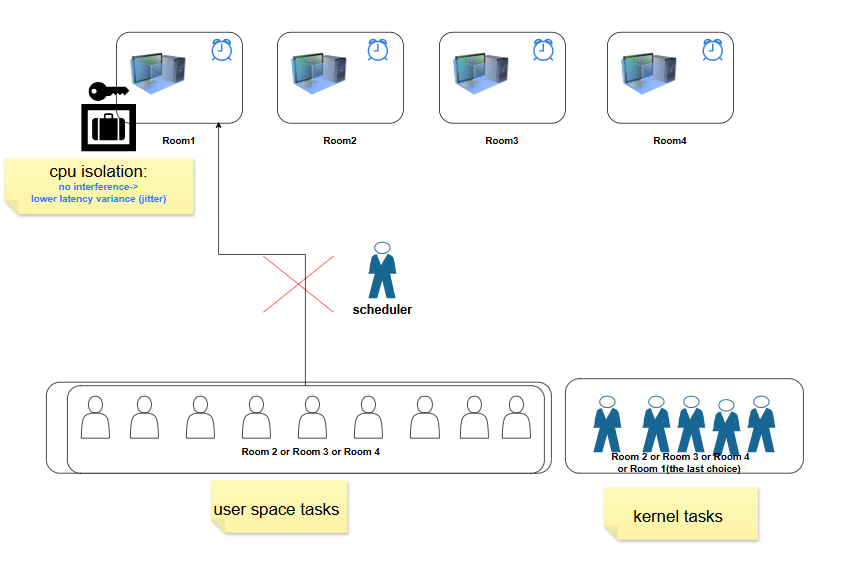
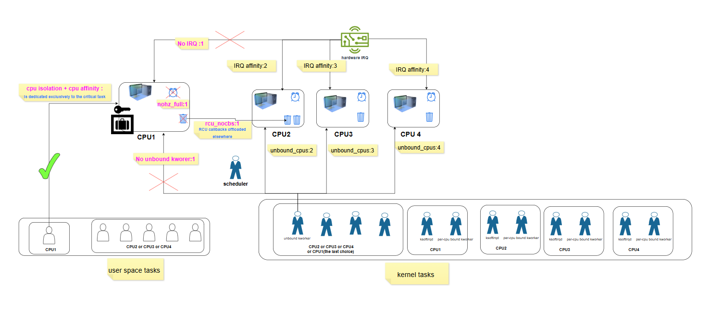
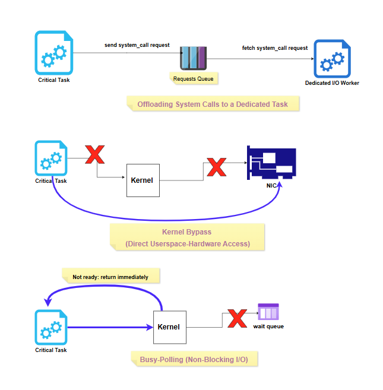
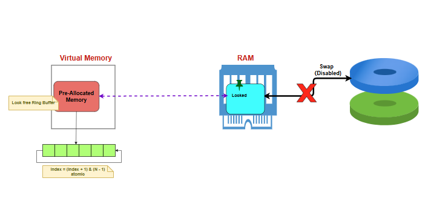
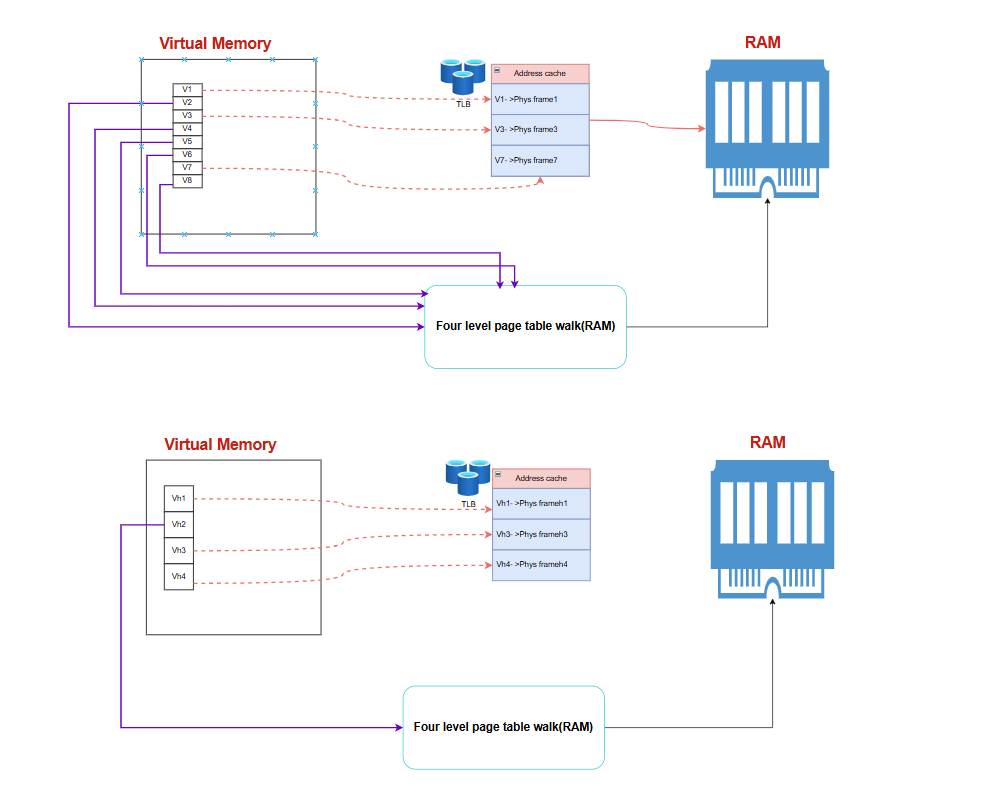
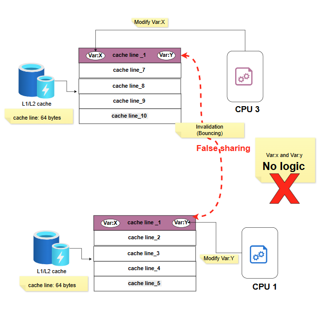
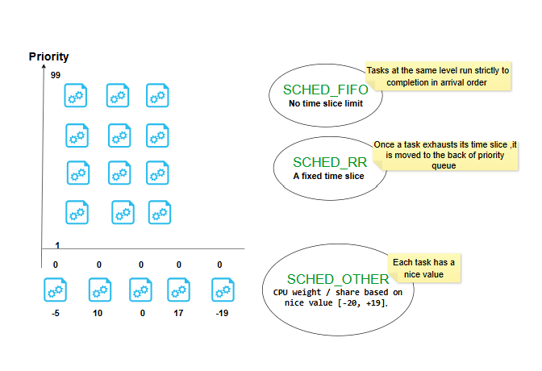

# Low-Latency Engineering 4: Putting It All Together — A Practical Playbook

The first three posts in this series were about *understanding*: what a mode switch and context switch actually are, what happens step by step inside the kernel during each one, and exactly what causes a page fault. This post flips to *doing* — the concrete techniques that take a critical task and give it the cleanest, most predictable execution environment possible.

I'll use the same room analogy from Post 2 to build intuition before getting into the actual mechanisms.

---

## 1. Giving Your Critical Task a CPU All to Itself

### 1.1 CPU Affinity: "You Prefer This Room"

**CPU affinity** means binding a task to a specific core — in the room analogy, a specific task is told "you always go to Room1" (or Room3, in the diagram). The benefit is written right on the sticky note: **L1/L2/L3 cache and TLB stay "warm"** for that task, because it keeps returning to the exact same physical core instead of bouncing around. Warm cache means fewer cache misses, which means lower average latency.

But notice what affinity *doesn't* do: the room isn't locked. Other tasks can still walk in when your task isn't using it. Affinity is a **preference**, not an **exclusion**.

### 1.2 CPU Isolation: "This Room Is Locked"

**CPU isolation** goes a step further: Room1 now has a lock on it. Ordinary tasks — the general population waiting in the queue for Room2, Room3, or Room4 — are no longer allowed in at all. The payoff, again straight from the diagram: **no interference → lower latency variance (jitter)**. This is the real point of isolation. Affinity gets you a warm cache on average; isolation gets you a *predictable* execution environment every single time, because nothing else is competing for that core.

### 1.3 Why Affinity + Isolation Alone Still Isn't Enough

Here's the part that's easy to miss: even with a locked room and a task that always goes there, a few uninvited guests can still show up.

- **Hardware interrupts** don't care about your lock. Unless you explicitly route them elsewhere (`irqaffinity`), they can still land on your isolated core.
- **The periodic timer tick** fires on every core by default, whether anything useful is happening there or not. `nohz_full` turns this off for the isolated core specifically.
- **RCU callbacks** — a routine kernel bookkeeping mechanism — are normally processed per-core. `rcu_nocbs` offloads this work to other cores instead.
- **Unbound kernel worker threads** (kworkers not tied to a specific core) can still be scheduled onto your isolated core unless you exclude it via `workqueue.unbound_cpus`.

There's one category you genuinely can't evict: **`ksoftirqd` and per-CPU-bound kworkers** exist on every core by design and can't be banned outright. But once you've removed the *triggers* — no interrupts routed there, no RCU work assigned there — they simply have nothing to do and sit idle. You're not banning them; you're starving them of a reason to wake up.

Put all four settings together — `isolcpus` + `irqaffinity` + `nohz_full` + `rcu_nocbs` + `workqueue.unbound_cpus` — and you get about as close to a private, undisturbed CPU as Linux allows.

---

## 2. Reducing Context Switches at the Source

### 2.1 Fewer Hardware Interrupts, Starting at Image Build Time

The cheapest interrupt is one that never exists. When building the OS image itself, stripping out unnecessary drivers and background services removes entire categories of potential interrupt sources before the system ever boots — this is a one-time decision made at image-build time, not something you can bolt on later without rebuilding.

### 2.2 Fewer System Calls

Three techniques, increasing in how aggressively they remove the kernel from the picture:

- **Offloading system calls to a dedicated task** — the critical task never calls into the kernel directly for non-essential work. It just drops a request onto a queue; a separate, dedicated I/O worker thread picks it up and deals with the kernel on the critical task's behalf.
- **Kernel bypass (direct userspace-hardware access)** — the critical task talks to the NIC directly, skipping the kernel entirely. No syscall, no mode switch, nothing.
- **Busy-polling (non-blocking I/O)** — instead of calling into the kernel and getting parked on a wait queue when data isn't ready, the critical task's non-blocking call returns immediately ("not ready"), and the task just loops and checks again — never blocking, never triggering a context switch.

### 2.3 Fewer Page Faults

This ties straight back to Post 3: **pre-allocate memory up front**, so the minor faults from first-touch allocation all happen during initialization instead of on the hot path. Use a **lock-free ring buffer** over that pre-allocated region so the critical task never calls `malloc`/`free` at runtime. Lock the memory into RAM so it can't be paged out. And **disable swap entirely** — with nowhere to swap to, a major page fault on the hot path isn't just unlikely, it's structurally impossible.

---

## 3. Rounding Out the Setup

### 3.1 Huge Pages

Post 3 covered the four-level page table walk — the expensive path that kicks in on a TLB miss. The fix is right there in the diagram: with regular-sized pages, covering a given range of memory needs many virtual-to-physical mappings (V1 through V8 in the top half), so the TLB can only hold translations for a fraction of them before misses start happening. With **huge pages** (bottom half), the same amount of memory is covered by far fewer, much larger pages (Vh1 through Vh4) — so a much higher share of your working set fits in the TLB at once, and the expensive four-level walk gets triggered far less often.

### 3.2 Avoiding False Sharing

Covered in detail in an earlier post, but worth repeating here as part of the full toolkit: two logically unrelated variables that happen to share a 64-byte cache line will cause two different cores to repeatedly invalidate each other's cached copy — a completely avoidable cost, fixed by padding shared data structures so each hot variable gets its own cache line.

### 3.3 SCHED_FIFO for the Tasks That Don't Get Their Own Core

You can't give every important task its own isolated core — there aren't enough cores, and most tasks don't need to run continuously anyway. But some of them need to respond *instantly* the moment they're needed (a risk check, an order cancellation). For those, **`SCHED_FIFO`** with a high priority is the answer: once such a task becomes runnable, it preempts anything lower-priority immediately, rather than waiting its turn in the normal fairness-based scheduler.

The three policies side by side:

- **`SCHED_FIFO`** — no time slice limit; tasks at the same priority level run strictly in arrival order, to completion.
- **`SCHED_RR`** — same idea, but with a fixed time slice; once it's used up, the task goes to the back of its priority queue.
- **`SCHED_OTHER`** (the default, CFS) — no fixed priority levels at all; every task gets a share of the CPU weighted by its nice value (-20 to +19).

### 3.4 One Detail on the Kernel Itself: PREEMPT_NONE

Worth mentioning here because it only makes sense in light of everything above: if your critical task is living on a fully isolated core (Section 1.3), building the kernel with the **`PREEMPT_NONE`** model is actually the *better* choice — not the "less advanced" one. The whole point of `PREEMPT_VOLUNTARY` or full `PREEMPT` is to let the kernel interrupt itself more eagerly so *other* tasks get better response times. But on a core where nothing else is supposed to be running in the first place, that extra preemption-checking machinery has nobody to protect — it's pure overhead with no benefit. `PREEMPT_NONE` skips it entirely.

---

## Bringing the Whole Series Together

Four posts, one continuous thread: **Post 1** gave the vocabulary (mode switch vs. context switch, and what always happens vs. what might happen). **Post 2** opened up the actual kernel mechanics behind a context switch. **Post 3** went deep on page faults specifically, since minor and major faults are worlds apart in cost. And this post turns all of it into an actual checklist — CPU isolation, reduced syscalls, pre-allocated memory, huge pages, false-sharing-safe data structures, and the right scheduling policy for the right task.

None of these techniques are secret. What changes once you understand the *why* behind each one is that you stop treating them as a checklist to blindly apply, and start knowing exactly which lever to pull when a latency number doesn't look right.

*This is post 4 of the series. Next up: the same toolkit, reorganized around a much more practical question — when do you actually implement each piece, and which file do you touch? From what gets baked into the OS image, to what's set via boot parameters, to what your application code does once at startup versus every cycle of its hot loop.*
